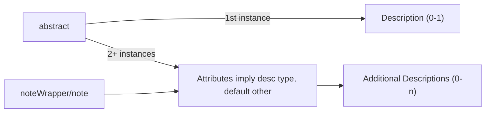
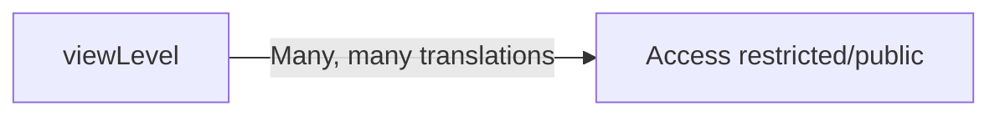

# EQUELLA -> InvenioRDM Crosswalk<

For upcoming VAULT migration. This page uses a <a href="https://mermaid.js.org/">Mermaid</a> <a href="https://mermaid.js.org/syntax/flowchart.html">flowchart</a>.

## MODS Mappings

These start at /xml/mods.

## Local Mappings

These start at /xml/local.

